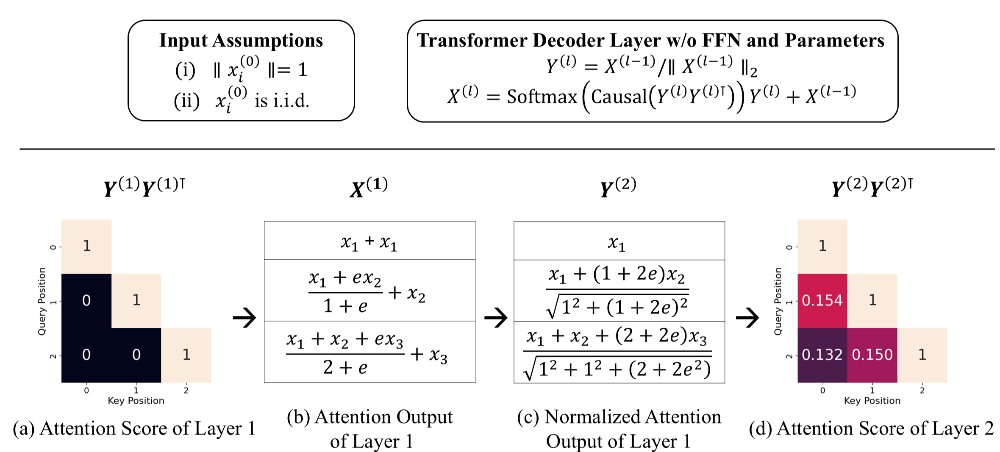

# Beyond RoPE: How Does Causal Mask Encode Positional Information?
- An official implementation of the paper [Beyond RoPE: How Does Causal Mask Encode Positional Information?]()

## Requirements
- `$pip install -r requirements.txt`
- FYI: tested with `transformers==4.52.4`

## Usage
- Each Jupyter notebook in the `concept` directory corresponds to a subsection of the paper:
  - `concept/math.ipynb`: Figure 1
  - `concept/simulation.ipynb`: Section 4.1
  - `concept/with_params.ipynb`: Section 4.2
  - `concept/simulation_rope.ipynb`: Section 5.1
  - `concept/rope_llms.ipynb`: Section 5.2
- The outputs of each notebook are saved in the `figures` directory.
- The model checkpoint for `concept/with_params.ipynb` will be provided in a future update.

## Citation
Citation information will be added soon.